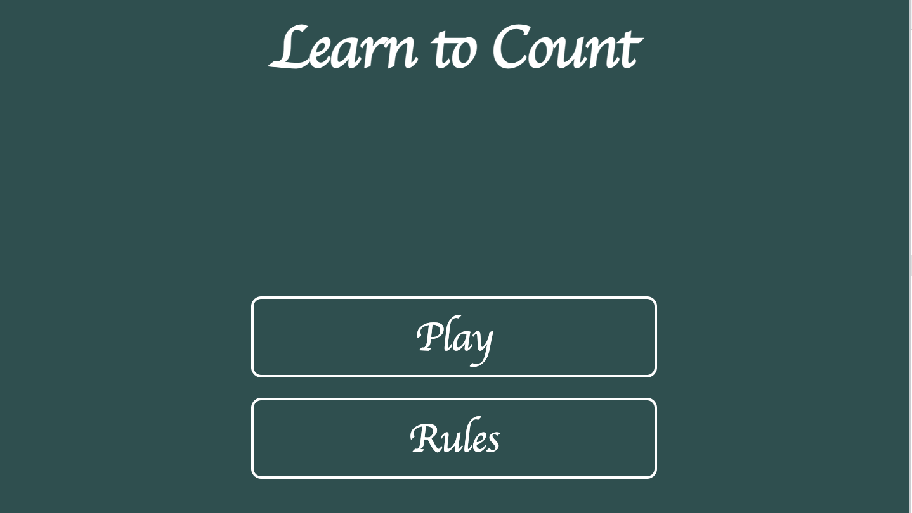
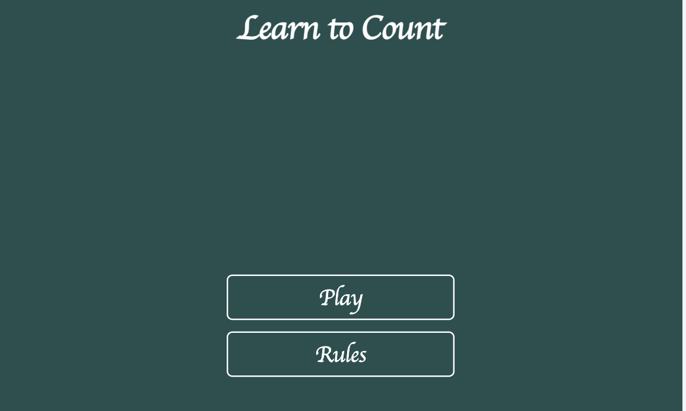
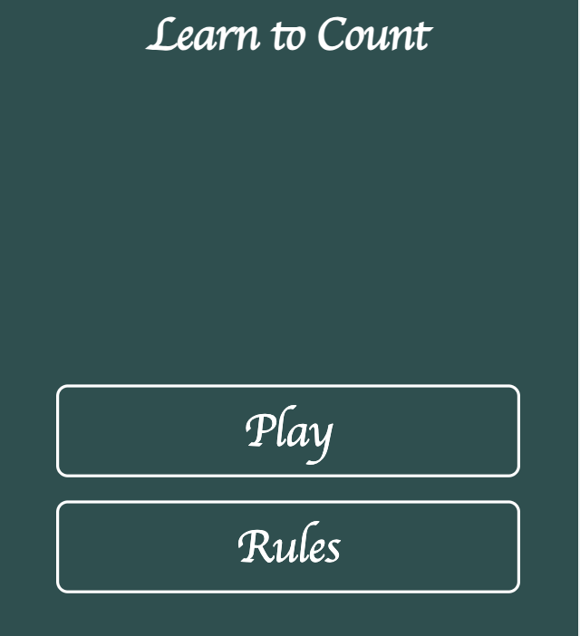
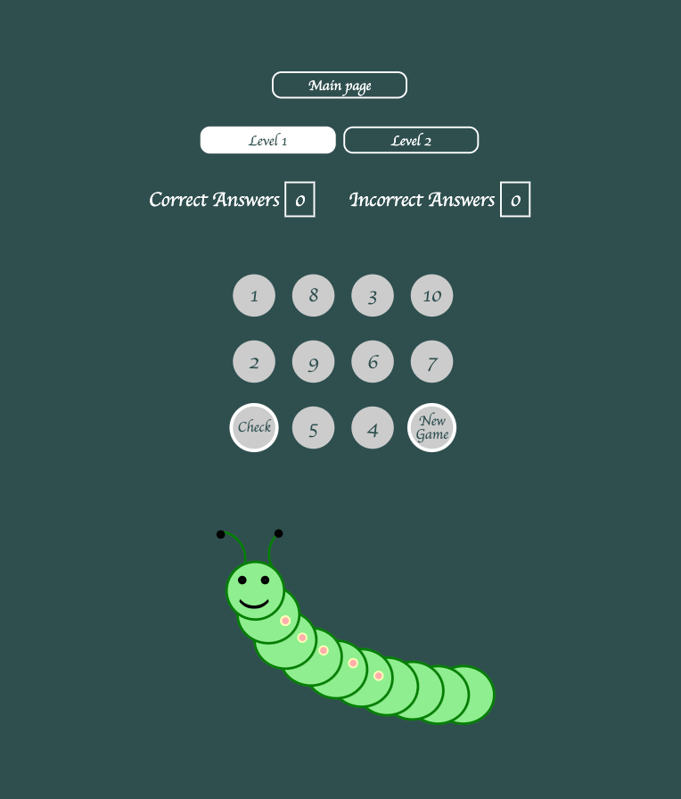
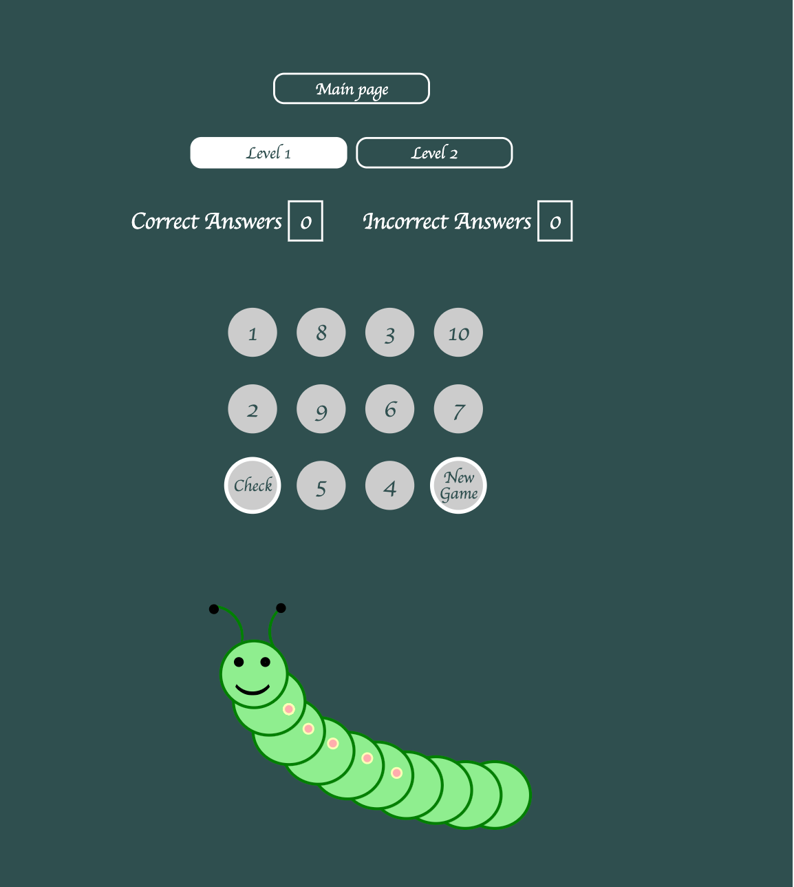
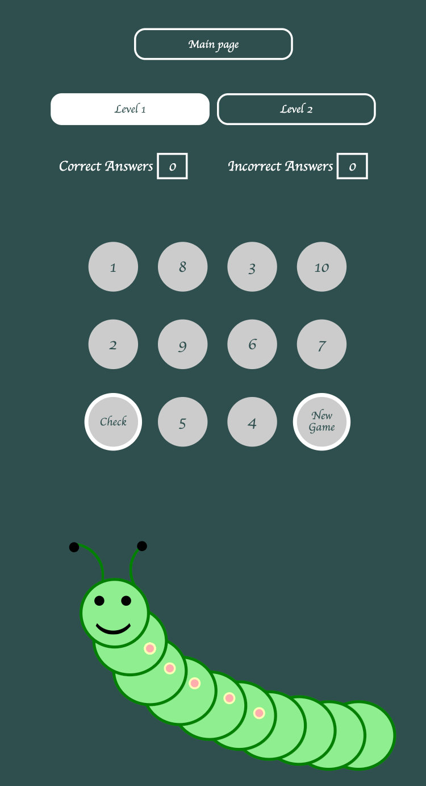
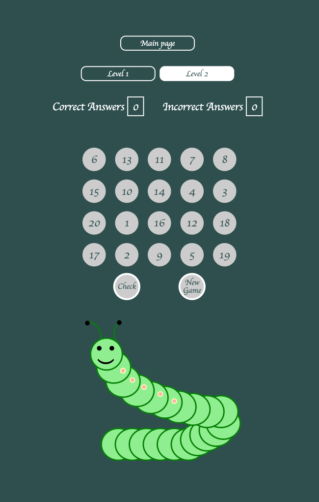
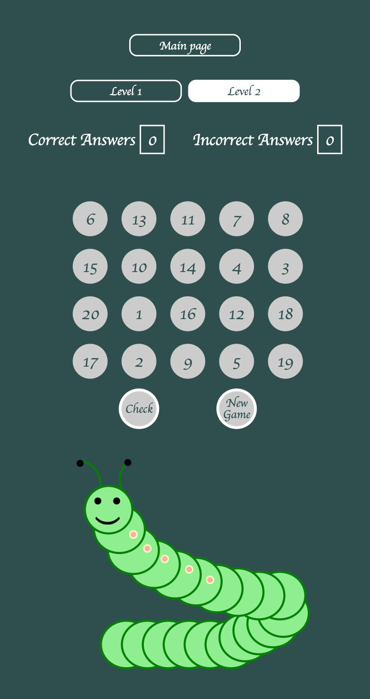
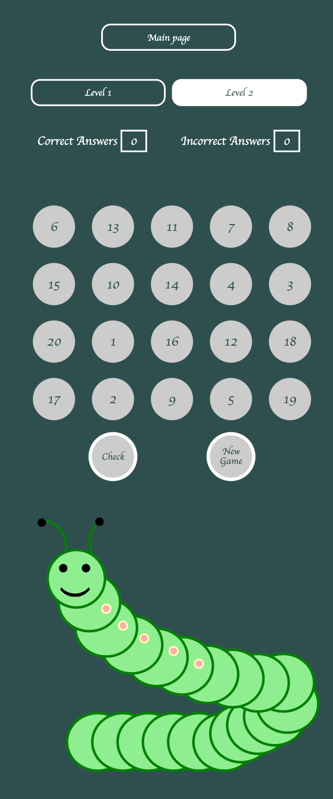

# _Learn to count_

---

[Learn to count](https://johns-costa.github.io/learning-to-count/) is a website for any child that wants to learn the numbers from 1 to 10 and 1 to 20. Watch the numbers change while pressed and the caterpillar as well!

---

## Technologies used

- [HTML](https://en.wikipedia.org/wiki/HTML)
- [CSS](https://en.wikipedia.org/wiki/CSS)
- [JavaScript](https://en.wikipedia.org/wiki/javascript)
- [Font Awesome icons](https://fontawesome.com/)
- [Google fonts](https://fonts.google.com/)

---

## User stories

- As a first time visitor, I want to understand the the website and it's game, so I can know the rules and start playing the game.
- As a first time visitor, I want to be able to easily navigate through the website, so I can find the information I am looking for.
- As a first time visitor, I want to see that the game is easy to handle and the interaction is fun, so I can learn the numbers quickly.
- As a user, I want to have fun with colors changing in the numbers and the caterpillar, so I can enjoy while learning.
- As a user, I want to be able to check the correct and incorrect answers, so I can know my progress.
- As a mobile device and tablet user, I want the game to be responsive, so I can use my phone or tablet to keep learning.

---

## Features

### Main page

- ##### Header

  - Positioned top of the page.
  - The header gives the user the tittle which self explaind the goal of the game

- ##### Play and Rules Buttons

  - Positioned center of the page.
  - The Play button lead the user to the play area.
  - The Rules button leads the user the the rules modal.
  - The Buttons have hovering effects in order to be more interactive.

  
  
  

---

- ##### Footer

  - Footer contains social media links that open in a new tab.
  - Under the social media links there is a copyright sign with my github link.

  

---
- ##### Level 1
  
- ##### Butons
  - At the center top there are 3 buttons positioned as a pyramid:
    - Main menu, that leads to the main menu.
    - Level 1, that lead to a new game at level 1.
    - Level 2, that lead to a new game at level 2.

- ##### Play area
  - Under the buttons we find the playing area where the numbers 1 to 10 are randomly placed.
  - Two extra circles are present:
    - Check, that allows the user to check if the selected pattern is correct.
    - New Game, the allows the user to play the game again with nrw randomly placed numbers.
  - The numbers change color when pressed.

- ##### Caterpillar
  -Under the play area there is a Caterpillar with 10 body parts.
  -The body part changes color when the number on the pattern is chosen.

  
  
  

---

- ##### Level 2
  
- ##### Butons

  - At the center top there are 3 buttons positioned as a pyramid:
    - Main menu, that leads to the main menu.
    - Level 1, that lead to a new game at level 1.
    - Level 2, that lead to a new game at level 2.

- ##### Play area

  - Under the buttons we find the playing area where the numbers 1 to 20 are randomly placed.
  - Two extra circles are present:
    - Check, that allows the user to check if the selected pattern is correct.
    - New Game, the allows the user to play the game again with nrw randomly placed numbers.
  - The numbers change color when pressed.

- ##### Caterpillar

  -Under the play area there is a Caterpillar with 20 body parts.
  -The body part changes color when the number on the pattern is chosen.

  
  
  
  
