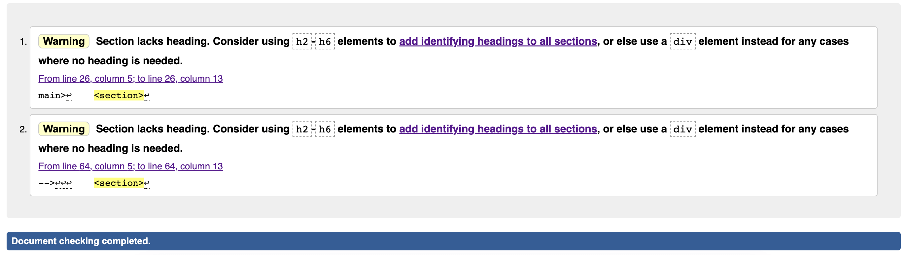
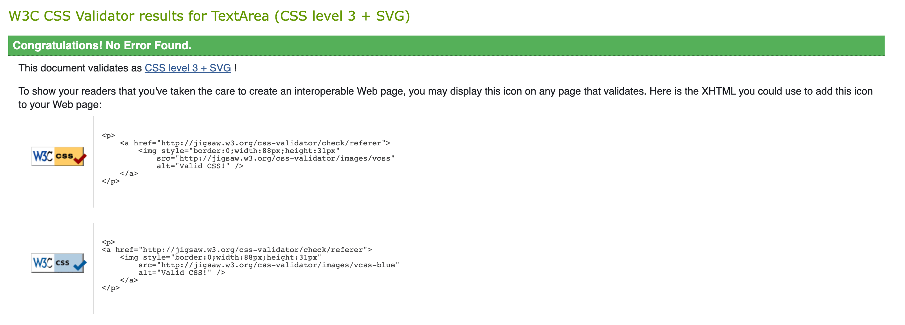
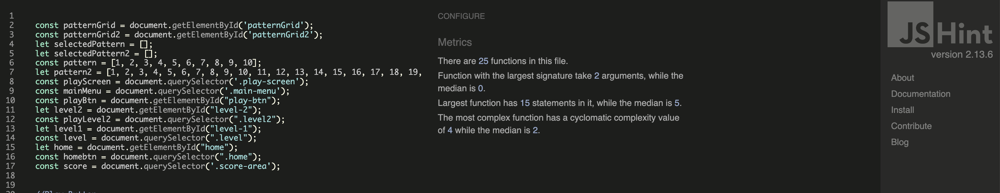
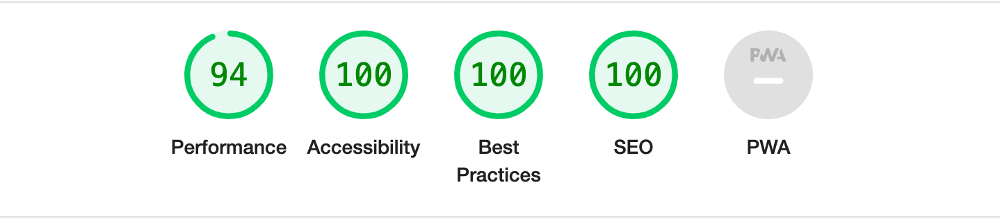
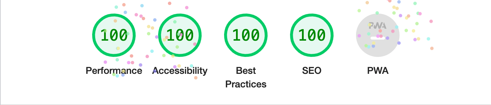
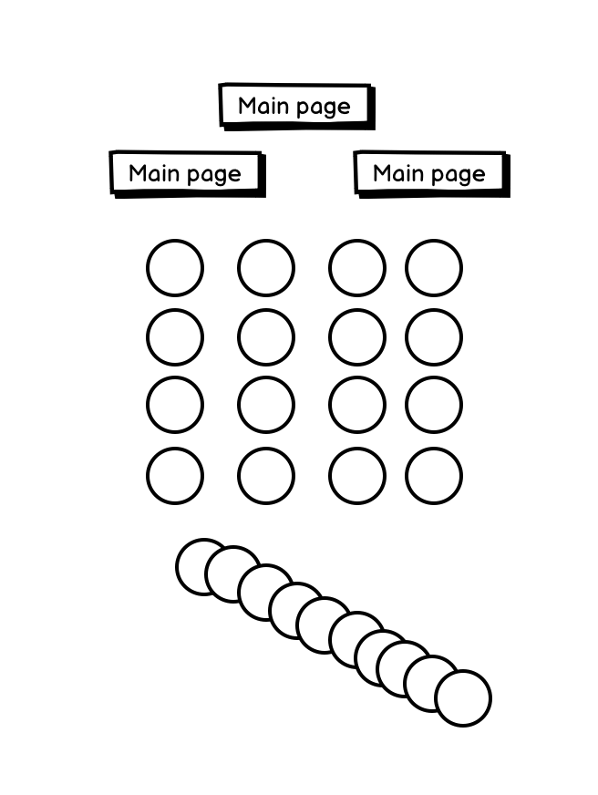

# _Learn to count_

---

[Learn to count](https://johns-costa.github.io/learning-to-count/) is a website for any child that wants to learn the numbers from 1 to 10 and 1 to 20. Watch the numbers change while pressed and the caterpillar as well!

---

## Technologies used

- [HTML](https://en.wikipedia.org/wiki/HTML)
- [CSS](https://en.wikipedia.org/wiki/CSS)
- [JavaScript](https://en.wikipedia.org/wiki/javascript)
- [Font Awesome icons](https://fontawesome.com/)
- [Google fonts](https://fonts.google.com/)

---

## User stories

- As a first time visitor, I want to understand the the website and it's game, so I can know the rules and start playing the game.
- As a first time visitor, I want to be able to easily navigate through the website, so I can find the information I am looking for.
- As a first time visitor, I want to see that the game is easy to handle and the interaction is fun, so I can learn the numbers quickly.
- As a user, I want to have fun with colors changing in the numbers and the caterpillar, so I can enjoy while learning.
- As a user, I want to be able to check the correct and incorrect answers, so I can know my progress.
- As a mobile device and tablet user, I want the game to be responsive, so I can use my phone or tablet to keep learning.

---

## Features

### Main page

- ##### Header

  - Positioned top of the page.
  - The header gives the user the tittle which self explaind the goal of the game

- ##### Play and Rules Buttons

  - Positioned center of the page.
  - The Play button lead the user to the play area.
  - The Rules button leads the user the the rules modal.
  - The Buttons have hovering effects in order to be more interactive.

  
  
  

---

- ##### Footer

  - Footer contains social media links that open in a new tab.
  - Under the social media links there is a copyright sign with my github link.

  

---

- ##### Level 1
  
- ###### Butons
  
  - At the center top there are 3 buttons positioned as a pyramid:
    - Main menu, that leads to the main menu.
    - Level 1, that lead to a new game at level 1.
    - Level 2, that lead to a new game at level 2.

- ###### Play area
  
  - Under the buttons we find the playing area where the numbers 1 to 10 are randomly placed.
  - Two extra circles are present:
    - Check, that allows the user to check if the selected pattern is correct.
    - New Game, the allows the user to play the game again with nrw randomly placed numbers.
  - The numbers change color when pressed.

- ###### Caterpillar

  - Under the play area there is a Caterpillar with 10 body parts.
  - The body part changes color when the number on the pattern is chosen.

  
  
  

---

- ##### Level 2
  
- ###### Butons

  - At the center top there are 3 buttons positioned as a pyramid:
    - Main menu, that leads to the main menu.
    - Level 1, that lead to a new game at level 1.
    - Level 2, that lead to a new game at level 2.

- ###### Play area

  - Under the buttons we find the playing area where the numbers 1 to 20 are randomly placed.
  - Two extra circles are present:
    - Check, that allows the user to check if the selected pattern is correct.
    - New Game, the allows the user to play the game again with nrw randomly placed numbers.
  - The numbers change color when pressed.

- ###### Caterpillar

  - Under the play area there is a Caterpillar with 20 body parts.
  - The body part changes color when the number on the pattern is chosen.

  
  
  

---

#### Manual testing

| feature | action | expected result | tested | passed | comments |
| --- | --- | --- | --- | --- | --- |
| Game area | | | | | |
| Play | Click on the "Play" button | The user is directed to the main area | Yes | Yes | - |
| Rules | Click on the "Rules" button | The user is irected to the modal with the rules | Yes | Yes | - |
| Main page | Click on the "Main page" button | The user is redirected back to the inical page| Yes | Yes | - |
| Level 1 | Click on the "Level 1" button | The user is directed to the level 1 game and a new game starts | Yes | Yes | - |
| Level 2 | Click on the "Level 2" button | The user is directed to the level 2 game and a new game starts | Yes | Yes | - |
| Divs 1 to 10 | Select the intended number | The div changes color | Yes | Yes | - |
| Divs 1 to 20 | Select the intended number | The div changes color | Yes | Yes | - |
| Correct answers| Number increases when a correct pattern is selected | The number increases| Yes | Yes | - |
| Incorrect answers| Number increases when an incorrect pattern is selected | The number increases| Yes | Yes | - |
| Footer | | | | | |
| Facebook icon in the footer | Click on the Facebook icon | The user is redirected to the Facebook page | Yes | Yes | - |
| Twitter icon in the footer | Click on the Twitter icon | The user is redirected to the Twitter page | Yes | Yes | - |
| YouTube icon in the footer | Click on the YouTube icon | The user is redirected to the YouTube page | Yes | Yes | - |
| Instagram icon in the footer | Click on the Instagram icon | The user is redirected to the Instagram page | Yes | Yes | - |

---

### Bugs

- ##### Solved bugs

  - I could not make the catterpillar sections change color while selecting the divs.
  - I fixed it by using targeting the different section - document.getElementById('body-part-' + event.target.innerText).
  
  - I could not make Level 2 accept a sellected pattern even when it was matching the pattern2
  - I fixed it by debugging it with devtools and finding out the the "incorrect answers" was in the correct answers of the function instead of the "correct answers"

- ##### Unsolved bugs

  - None.

---

### Validator testing

- ##### HTML

  - No errors were found when passing through the official W3C validator. Only 2 warnings that were necessary for the funtionality od the game.
  

- ##### CSS

  - No errors or warnings were found when passing through the official W3C (Jigsaw) validator.
  

- ##### JavaScript

  - No errors or warnings were found when passing through the official JSHINT validator.
  

- ##### Accessibility and performance

  - Using lighthouse in devtools I confirmed that the website is performing well, accessible and colors and fonts chosen are readable. Both in desktop (first image) and in mobile mode (second image).

    
    

---

### Deployment

- The site was deployed to GitHub pages. The steps to deploy are as follows:
  - In the GitHub repository, navigate to the Settings tab
  - From the source section drop-down menu, select the Main Branch, then click "Save".
  - The page will be automatically refreshed with a detailed ribbon display to indicate the successful deployment.
- The live link can be found [Learn to Count](https://johns-costa.github.io/learning-to-count/).

---

### Credits

- ##### Content

  - The code to make the footer links was partially from the [Thread and Rope](https://johns-costa.github.io/threadandrope), Thread and Rope, and modified to fit this website.
  - The code to make the caterpillar was partially from the [Codepen Caterpillar](https://codepen.io/maahi21/pen/vYyKxwG), Codepen website, and modified to fit this game.
  - The code to make the Modal was partially from the [W3schools Modal](https://www.w3schools.com/howto/tryit.asp?filename=tryhow_css_modal), W3schools website, and modified to fit this game.

- ##### Media

  - The website game has no images, whit the exception of the favicon that was created by me.
  - All the images for the README.md were taken by me.

---

#### Wireframes

